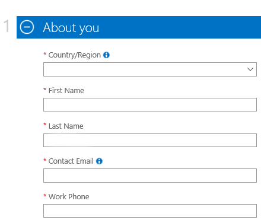

#Configuración de una cuenta de prueba en Microsoft Azure#

Los titulos estan en español y los screenshos en inglés de forma intencional para poder guiar a personas
 con el portal configurado en cualquier de los dos idiomas
 
 1. Ingresa a la página https://www.windowsazure.com/en-us/  y haga clic en la opción "FREE ACCOUNT"
 
 2. A continuación haga clic en el botón "Start Now"
 
 3. Si nunca ha configurado una cuenta de prueba de azure, puede ingresarla en este momento, de lo contrario, cree una nueva cuenta para realizar la prueba.
 
 4. ingrese la información adicional, notará que el sistema le pedirá ingresar información de su tarjeta de credito, un cargo minimo será registrado a su cuenta pero después será devuelto.  Es la forma de validar que usted no es un robot.
 
 5. Una vez registrados los pasos de verificación de la identificación, podrá comenzar a disfrutar de los 30 días de prueba de la plataforma o de los 200 dólares de saldo.
 
 NOTA:  Recuerde que si deja encendidas máquinas y/o servicios de alto consumo, podrá consumirse en saldo de prueba en menos tiempo.
 6. Una vez terminada la configuración, será redireccionado al portal de administración de recursos.
 
 
 
